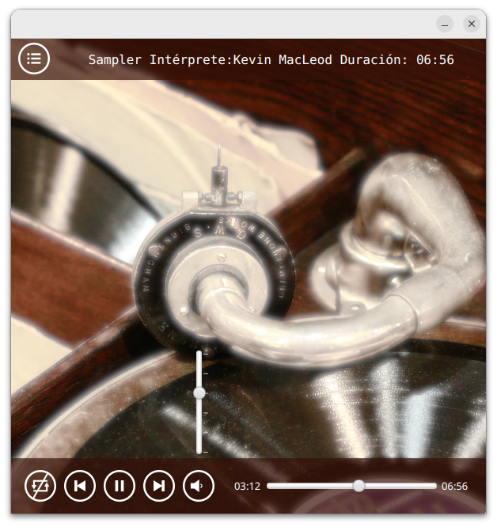

# DINOS javafx exercice

This practice consist on develop a single-file local music player.

## Develope Notes

The issues of this practice are to manage listeners  and to develop a spected UI where all elements do that the spected to.
Seems easy, but not  trivial. In addition, i've developed some animation,  as seen the needing of refresh of the status playing slider.

Requirements propose to implement a Track class,those ive added a list od tracked files and a map to store their metadata.

Happy playing!

## ScreenShoots

images  music are public domain.